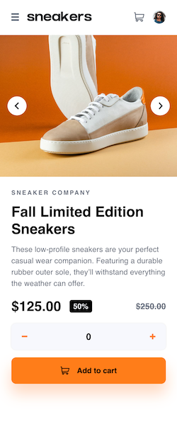
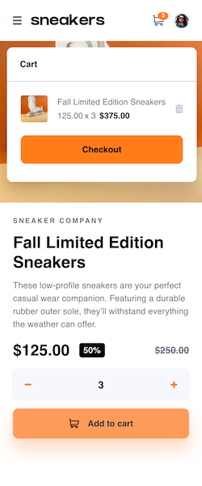
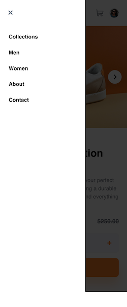
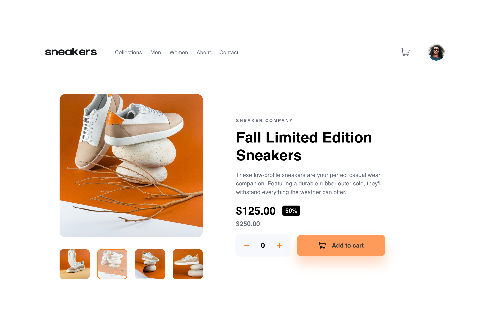
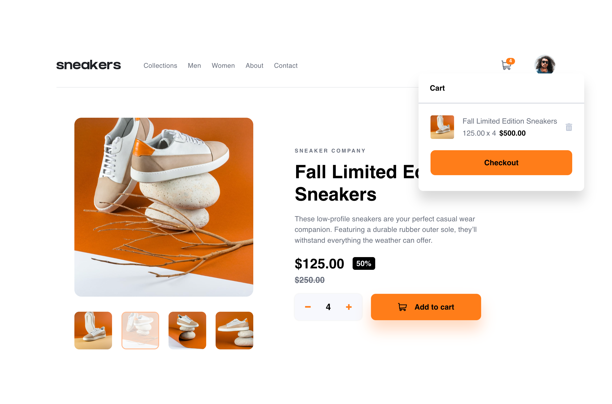

# Frontend Mentor - E-commerce product page solution

This is a solution to the [E-commerce product page challenge on Frontend Mentor](https://www.frontendmentor.io/challenges/ecommerce-product-page-UPsZ9MJp6). Frontend Mentor challenges help you improve your coding skills by building realistic projects.

## Table of contents

- [Overview](#overview)
  - [The challenge](#the-challenge)
  - [Screenshot](#screenshot)
  - [Links](#links)
- [My process](#my-process)
  - [Built with](#built-with)
  - [What I learned](#what-i-learned)
  - [Continued development](#continued-development)
  - [Useful resources](#useful-resources)
- [Author](#author)
- [Acknowledgments](#acknowledgments)

**Note: Delete this note and update the table of contents based on what sections you keep.**

## Overview

### The challenge

Users should be able to:

- View the optimal layout for the site depending on their device's screen size
- See hover states for all interactive elements on the page
- Open a lightbox gallery by clicking on the large product image
- Switch the large product image by clicking on the small thumbnail images
- Add items to the cart
- View the cart and remove items from it

### Screenshot

### mobile version  

 <table>
   <tr>
      <th style="font-size:12px">mobile design</th>
      <th style="font-size:12px">mobile active</th>
      <th style="font-size:12px">mobile menu</th>
   </tr>
   </tr>
      <td></td>
      <td></td>
      <td></td>
   <tr>
</table>

### desktop version

<table>

  <tr>
    <th style="font-size:12px">desktop design</th>
    <th style="font-size:12px">desktop active</th>
  </tr>
  <tr>
    <td></td>
    <td></td>
  </tr>
</table>

### Links

- Solution URL: [my solution here](https://github.com/sportif7/E-commerce-product-page.git)
- Live Site URL: [my live site here](https://sportif7.github.io/E-commerce-product-page/)

## My process

### Built with

- Semantic HTML5 markup
- CSS custom properties
- Flexbox
- Mobile-first workflow

### What I learned

I learned array and NodeList manupulation through build array functions.

### Continued development

Improve my frontend skills by building another challenging project.

### Useful resources

I want to thank to Josh Comeau for his sources which I used in this project: https://www.joshwcomeau.com/css/custom-css-reset/ 

## Author

- Frontend Mentor - [Mario H](https://www.frontendmentor.io/profile/sportif7)

